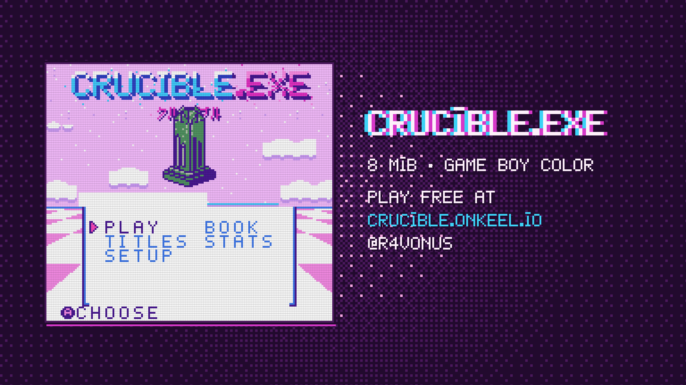
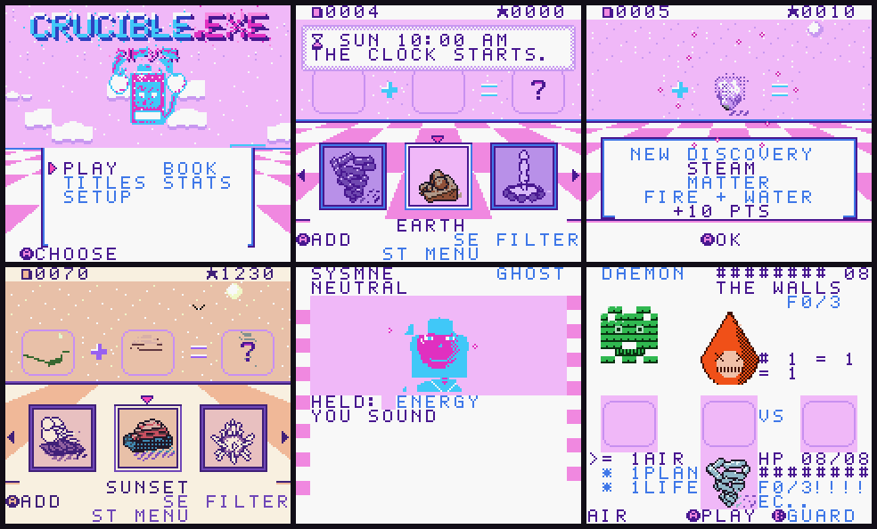

# CRUCIBLE.EXE

[](https://crucible.onkeel.io)

**Play it at [crucible.onkeel.io](https://crucible.onkeel.io)** ·
[watch the trailer](https://crucible.onkeel.io/trailer/crucible-trailer.mp4) · [@R4vonus](https://x.com/R4vonus)

A Game Boy Color cartridge about a bench in a room that should not be there. You put two things on it. They lean toward
each other, lose their edges, and become a third thing you did not have before. Nobody tells you why you are here. The
clock asks what time it is. Someone is waiting just above the screen.



`release/crucible.exe.gbc` is the cartridge: 8 MB, MBC5 with 128 KB battery-backed RAM, Game Boy Color only. It runs
in any accurate CGB emulator and on hardware from a flash cart.

## What is in the cartridge

- **5,629 things and 13,439 ways to make them**, from earth, water, fire and air outward. Every object is drawn from
  its own 3D construction, with eight resting poses and a twelve-view turntable, and a second layer of material
  colour drawn as sprites over the background.
- **The bench.** Pick two, watch their real sprites stretch toward each other and fuse, then see what came out, already
  turning. A new discovery is worth points; a pair that makes nothing is remembered as tried, never as impossible.
- **The book**, filters by type and by trait (hot, cold, wet, shiny, alive, magic...), titles earned from what you make,
  stats and a leaderboard of your best runs.
- **Story runs**, three save slots beside free play. Factions like or hate you for what you make and say. Talks and
  fights come to the bench: a face peeking in from above is a voice, eyes at the floor's edge are trouble. Chapters move
  because of what happens there, and the truth of where you are shifts with it.
- **Visitors** generated on the cartridge: a name, an archetype, a face built from primitives, and a conversation that
  remembers you.
- **Living rooms** that change with your save, the place and the hour, and a sense of time without a clock chip: it
  notices when you have been away.
- **Lost pieces.** Something you lose cools down before it can be made again, and the bench glitches when you try.
- **Fights**: bosses that telegraph their moves, duels, a kit built from what you have made, and a face of your own.
- **Link cable play** for two (below).
- A chip-groove soundtrack (the trailer's, live on the cartridge), secrets, and a few doors that are not doors.

## Controls

| Where        | Button                  | Does                                                                    |
| ------------ | ----------------------- | ----------------------------------------------------------------------- |
| Bench        | Left / Right            | move along the shelf (hold to keep moving)                              |
|              | Up / Down               | jump between groups; go toward a waiting visitor (up) or fighter (down) |
|              | A                       | put the focused thing on the bench; A on a second thing mixes them      |
|              | B                       | put back; with nothing held, clear the filter                           |
|              | Select                  | filter by type or trait                                                 |
|              | Start                   | menu: RESUME, BOOK, TITLES, STATS, SETUP, LEAVE (or SEND while linked)  |
| Book         | Up / Down, Left / Right | rows, pages; A returns to that thing on the bench                       |
| Talk / fight | D-pad, A                | choose what to say or what to throw                                     |
| Anywhere     | A + B + Start + Select  | soft reset (the save is untouched)                                      |

SETUP holds music, sound, the turn speed, the time, how to play and RESET GAME (hold A for two seconds: discoveries,
book, titles, stats and runs are erased; settings and your name stay).

## Link cable

PLAY → LINK → HOST or JOIN opens the link room. The host chooses the rules and starts; the guest waits.

- **CO-OP**: every new discovery lands in the partner's book too; SEND on the pause menu gives them your focused thing.
  Ends at the time limit, if one is set.
- **RACE**: first to the goal number of new finds; scores cross the cable every second. Goal, time limit or a draw.
- **FIGHT**: a bout, each player with their own things. Only inputs cross the cable; both Game Boys resolve each turn
  the same way and compare a checksum, so a desync ends the bout like a pulled cable. The winner keeps a copy of the
  loser's last fighter; nobody loses anything.

Sessions use each player's free-play save; a story run is saved and left first. Pulling the cable, or 8 seconds of
silence in a session, ends it as LINK LOST. The cartridge clocks the serial port itself, one byte each way per frame,
so it works on real hardware and in emulators with link support; `test/harness/linkbridge.py` plays the cable
between two headless emulators.

## Build

The ROM is reproducible byte for byte with the pinned toolchain: **GBDK-2020 4.5.0** (SDCC 4.5.1 #15267).

```sh
sh tools/install-gbdk.sh        # downloads the pinned GBDK into ~/.cache/gbdk-4.5.0 and checks its sha256
npm ci                          # Node 22.18+; TypeScript tools run with Node's type stripping
npm run verify                  # builds build/crucible.gbc and checks it against release/SHA256SUMS
```

Byte-for-byte reproduction needs the macOS build of GBDK 4.5.0 (Apple silicon; CI runs it on `macos-15`). The
Linux build of the same release allocates registers differently in a handful of units, so a ROM built on Linux does
not match the release hash.

`GBDK_HOME` points the build (and the installer) at another location. `npm run build` builds without the check. The
build compiles every unit with warnings as errors, links with autobanking in a fixed order (part of the ROM's
identity), and finishes the header.

SDCC aborts on any command-line argument that contains `.exe`, and a clone of this repository is usually a directory
named `crucible.exe`. So the build passes repository-relative paths only, and GBDK has to live outside the clone.

## Tests

```sh
python3 -m venv .venv && .venv/bin/pip install -r requirements-dev.txt

npm run typecheck && npm run lint && npm test     # TypeScript, ESLint, Prettier, clang-format, tool tests
.venv/bin/ruff check && .venv/bin/ruff format --check && .venv/bin/mypy

CC=clang sh tools/core-tests.sh test                       # the rules core on the host, with ASan and UBSan
PYTHON=.venv/bin/python sh tools/core-tests.sh sm83-test   # the same scenarios on a real SM83 core, compared
```

The harnesses play the real ROM headless in PyBoy (CGB, blank saves, deterministic input), assert on what the screen
and memory say, and write a screenshot at every step:

```sh
.venv/bin/python test/harness/capture_flow.py build/crucible.gbc out/flow                 # the whole game flow
.venv/bin/python test/harness/capture_link.py build/crucible.gbc out/link                 # two machines on a cable
.venv/bin/python test/harness/capture_discoveries.py build/crucible.gbc out/discoveries   # reveals turn and colour
.venv/bin/python test/harness/capture_overlay.py build/crucible.gbc out/overlay           # the material layer
.venv/bin/python test/harness/capture_lost_piece.py build/crucible.gbc out/lost           # a lost piece's cooldown
.venv/bin/python test/harness/capture_fight.py build/crucible.gbc out/fight               # a story fight
```

They read symbols from `build/crucible.noi` and the listings in `build/obj`, so run them on a build from this tree.

## How the art gets onto a cartridge

Every object starts as a small declarative program: parts, joints, materials and motion, at most 24 parts. A private
toolchain (the KEEL engine and its bake, not part of this repository) renders each program in 3D with fixed lighting,
dithers it to the Game Boy's four-colour tiles, and records a keyframe plus two chains of frames: eight resting poses
and a twelve-view turntable. A second pass solves each object's material layer, three more colours drawn as sprites.

The frames are compressed losslessly with a context model: every pixel is predicted from its neighbours in the frame
being decoded and the frame before, by a static 8 KB model trained on the whole catalogue, and coded with a
multiply-free binary arithmetic coder. That is about 0.8 KB per object. The records are packed into 16 KB ROM banks
with a directory.

On the cartridge, `cartridge/include/keel_retro_ctx.h` decodes a few rows per frame per animated cell (the hot path
is SM83 assembly) and caches finished frames in CGB work-RAM banks 2 to 7, so only the first loop of an animation is
decoded. Palettes, busts, rooms, text and the catalogue tables are baked the same way.

Everything the bake produces is committed under `cartridge/data` (and `core/generated`), so the ROM builds from this
repository alone. Regenerating it needs the private toolchain.

## Layout

```
cartridge/src       the game: screens, bench, fusion, reveal, talk, fight, link, rooms, sound, time
cartridge/include   its headers and the retro codec, palette lease, dialogue and music headers it compiles against
cartridge/data      baked data (generated, committed): art banks, palettes, busts, rooms, text, catalogue banks
core                the rules: catalogue, mixing, scoring, feats, titles, saves, story runs, the saga (portable C99)
catalogue           the catalogue as JSON, for the harnesses and the fight simulators
test/harness        headless PyBoy harnesses
tools               the ROM build, toolchain install, core checks, format check
docs                game flow, save structures, time, the fight system and its simulators
release             the release ROM and its sha256
```

## Credits

Made by Ravonus ([@R4vonus](https://x.com/R4vonus)). Play it at [crucible.onkeel.io](https://crucible.onkeel.io);
the trailer is at [crucible.onkeel.io/trailer](https://crucible.onkeel.io/trailer/crucible-trailer.mp4).

Built with Codex and Claude. Compiled with [GBDK-2020](https://github.com/gbdk-2020/gbdk-2020) and SDCC; tested with
[PyBoy](https://github.com/Baekalfen/PyBoy).

## Licence

Two licences, by path:

- **Code, tools, harnesses and the built ROM: MIT** ([LICENSE](LICENSE)). That is `cartridge/src`, `cartridge/include`
  (the `keel_*.h` engine headers included), `core/` except `core/generated`, `tools/`, `test/`, the fight simulators
  in `docs/fight-system/sim`, `cartridge/data/include/crucible_ctx_model.h` and `crucible_music_data.h`, and
  `release/crucible.exe.gbc`.
- **Art, catalogue, rooms and the story and dialogue text: CC0 1.0** ([LICENSES/CC0-1.0.txt](LICENSES/CC0-1.0.txt)),
  dedicated to the public domain. That is everything else under `cartridge/data` (art, busts, palettes, rooms, UI
  tiles, text, catalogue banks and their generated headers), `core/generated`, `catalogue/` and `docs/images/`.

Third-party notices (the GBDK and SDCC runtime libraries linked into the ROM) are in [NOTICE](NOTICE).
